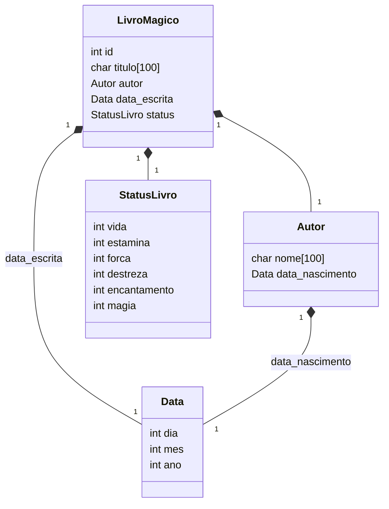
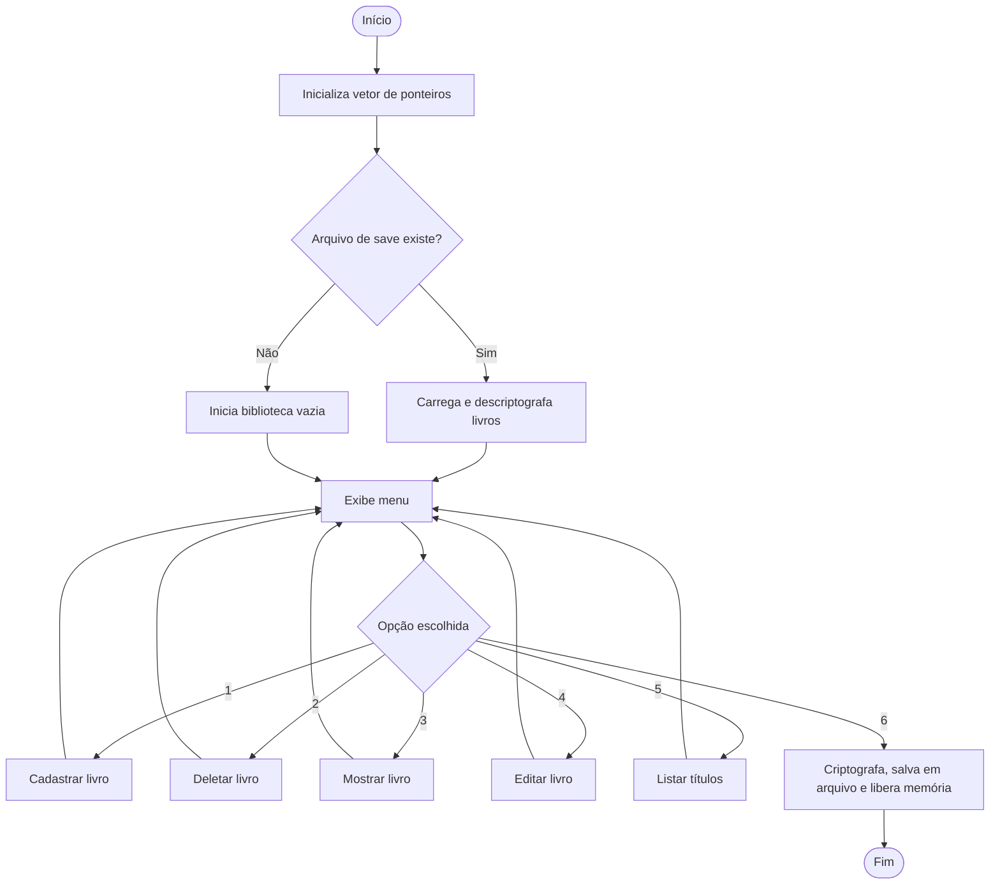

<div align="center">

# 📖 Biblioteca Mágica

### Mini Projeto 03 — Backend de Jogo em C

*Structs, Ponteiros, Alocação Dinâmica e Manipulação de Arquivos*


</div>

---

## 📜 Sobre o projeto

**Biblioteca Mágica** é um sistema de gerenciamento de inventário para um RPG fictício, onde cada "livro mágico" funciona como um item/personagem com atributos próprios (vida, estamina, força, destreza, encantamento e magia). O sistema persiste os dados em arquivo binário **criptografado**, permitindo salvar e carregar o progresso entre execuções.

O projeto foi desenvolvido como exercício de:

- Manipulação de **structs aninhadas** (`Data`, `Autor`, `StatusLivro`, `LivroMagico`)
- **Alocação dinâmica de memória** (`malloc`/`free`) para cada livro cadastrado
- **Leitura e escrita de arquivos binários** (`fread`/`fwrite`)
- Validação de datas (ano bissexto, dias por mês, consistência entre datas)
- Interface de terminal colorida via códigos ANSI

---

## ✨ Funcionalidades

| # | Funcionalidade         | Descrição                                                              |
|---|-------------------------|-------------------------------------------------------------------------|
| 1 | Cadastrar livro         | Cria um novo livro em posição livre (automática ou escolhida)          |
| 2 | Deletar livro           | Remove um livro pelo `id` e libera a memória alocada                   |
| 3 | Mostrar livro           | Exibe todos os dados e atributos de um livro específico                |
| 4 | Editar livro            | Atualiza título, autor, datas e atributos de um livro existente        |
| 5 | Listar títulos          | Lista todos os livros cadastrados com seu nível de poder                |
| 6 | Salvar e sair           | Grava a biblioteca em arquivo (criptografado) e libera toda a memória  |

Cada livro possui um **Nível de Poder** (`D` a `S`), calculado pela média dos 6 atributos:

```
média < 20  → D
média < 40  → C
média < 60  → B
média < 80  → A
média ≥ 80  → S
```

---

## 🧩 Modelo de dados



A biblioteca inteira é representada por um vetor de ponteiros:

```c
struct LivroMagico *biblioteca[MAX_LIVROS]; // MAX_LIVROS = 100
```

Cada posição é `NULL` (livre) ou aponta para um `LivroMagico` alocado dinamicamente.

---

## 🔁 Fluxo do programa



---

## 💾 Persistência de dados

Os dados são salvos em um arquivo binário no seguinte formato:

```
[int quantidade]
[struct LivroMagico livro_1]
[struct LivroMagico livro_2]
...
[struct LivroMagico livro_n]
```

Antes de gravar, o **título** de cada livro é criptografado com complemento de 255 por byte (`255 - caractere`), operação que é sua própria inversa — ou seja, aplicar a mesma função duas vezes restaura o valor original.

---

## ⚙️ Como compilar e executar

```bash
gcc -o biblioteca biblioteca.c
./biblioteca save.dat
```

> O argumento `save.dat` é o nome do arquivo onde a biblioteca será salva/carregada. Se o arquivo não existir, uma nova biblioteca vazia é iniciada.

**Requisitos:** GCC (ou compilador C compatível com C89). No Windows, o programa habilita automaticamente o suporte a cores ANSI no console.

---

## 🗂️ Estrutura do repositório

```
mp-ip-magicLibrary/
├── biblioteca.c      # Código-fonte principal
├── README.md         # Este arquivo
└── save.dat          # Gerado automaticamente na primeira execução
```

---

## 👤 Autor

Desenvolvido por **Matheus** — estudante de Ciência da Computação na UFG.

---

<div align="center">

*Projeto acadêmico desenvolvido para a disciplina de Introdução à Programação.*

</div>
